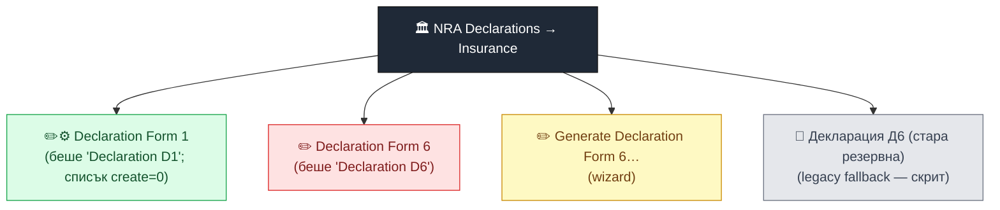
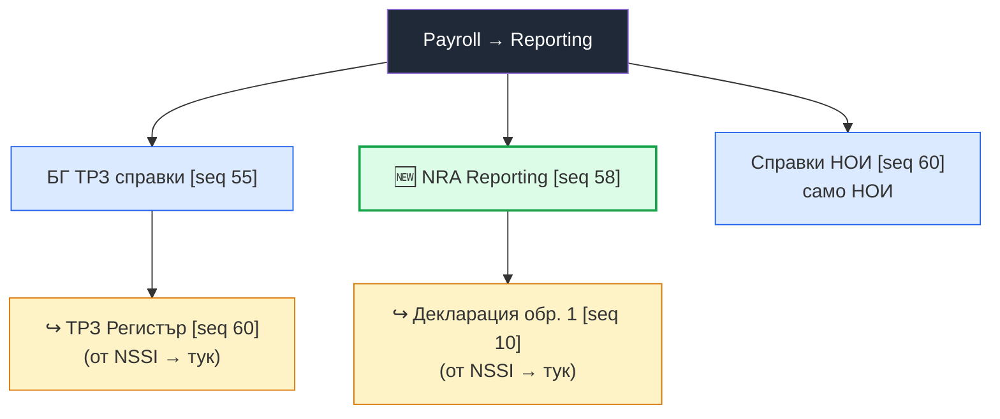
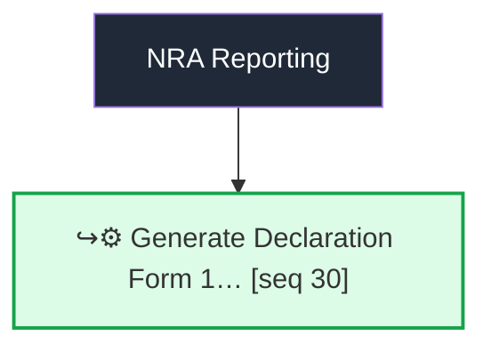
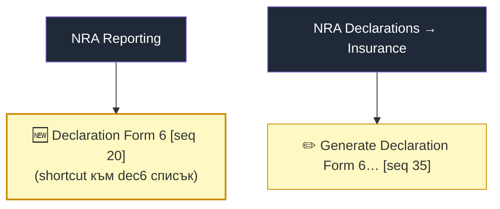
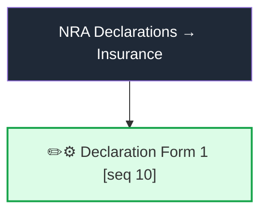
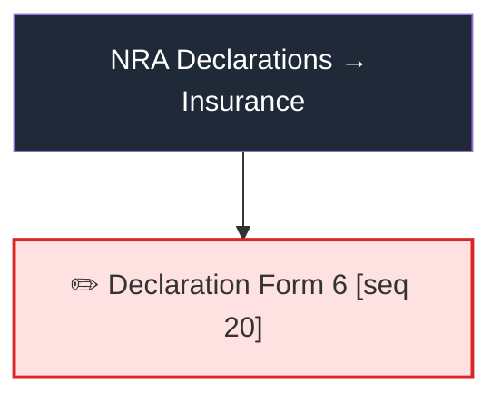
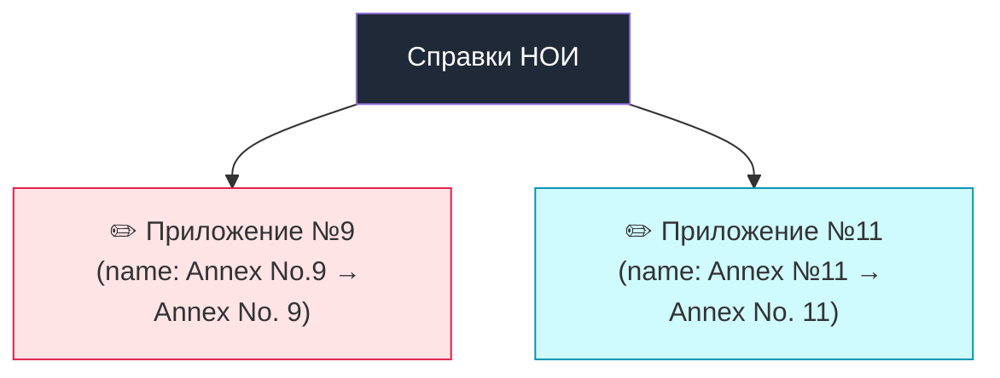
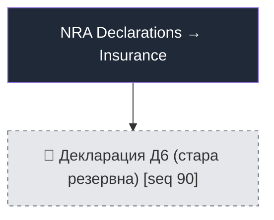

# l10n_bg — Промени по менютата (NAP/НОИ + D1 фаза 2)

> Сесия **2026-06-30** · извлечено от живата дев база `l10n_bg`.
> Диаграмите са **Mermaid** — рендват се като картинки в GitHub / VS Code / повечето MD четци.

## Легенда

| Знак | Значение |
|------|----------|
| 🆕 | Нов елемент (добавен тази сесия) |
| ↪️ | Преместен (нов родител) |
| ✏️ | Преименуван |
| 🚫 | Скрит (`groups="base.group_no_one"`) |
| ⚙️ | Промяна в поведение (напр. `create="0"`) |
| ⚪ | Заварен (за контекст, не е пипан) |

---

## 🗺️ Обща картина — двете засегнати дървета

### Payroll → Reporting

```mermaid
graph TD
    R["📊 Payroll → Reporting"]:::core

    R --> BPR["БГ ТРЗ справки<br/>Bulgarian Payroll Reports"]:::hp
    R --> NRA["🆕 NRA Reporting<br/>(НАП — отделно от НОИ)"]:::hp
    R --> NSSI["Справки НОИ<br/>NSSI Reporting — само НОИ"]:::hp

    BPR --> UP2["⚪ Удостоверение УП-2"]:::hp
    BPR --> UP3["⚪ Удостоверение УП-3"]:::hp
    BPR --> INC["⚪ Удостоверение за доход"]:::hp
    BPR --> RECAP["⚪ Рекапитулация / Отсъствия"]:::hp
    BPR --> SHEET["⚪ Ведомост за заплати"]:::hp
    BPR --> REG["↪️ ТРЗ Регистър<br/>(преместен от НОИ)"]:::hp

    NRA --> D1L["Декларация обр. 1<br/>(списък)"]:::hp
    NRA --> D6S["🆕 Declaration Form 6<br/>(shortcut)"]:::noi
    NRA --> GEN1["↪️⚙️ Generate Declaration Form 1…<br/>(wizard — преместен тук, фаза 2)"]:::dec1

    NSSI --> CERT["⚪ Удостоверения"]:::hp
    NSSI --> ERBL["⚪ ЕРБЛ (Sick Leaves)"]:::erbl
    NSSI --> A9["✏️ Приложение №9"]:::pril9
    NSSI --> A10["⚪ Приложение №10"]:::pril10
    NSSI --> A11["✏️ Приложение №11"]:::pril11
    NSSI --> HIST["⚪ История на декларации"]:::hp
    NSSI --> EXP["⚪ Пакети за експорт"]:::hp

    classDef core fill:#1f2937,color:#fff,stroke:#111;
    classDef hp fill:#dbeafe,stroke:#2563eb,color:#1e3a8a;
    classDef dec1 fill:#dcfce7,stroke:#16a34a,color:#14532d;
    classDef noi fill:#fef9c3,stroke:#ca8a04,color:#713f12;
    classDef erbl fill:#f3e8ff,stroke:#9333ea,color:#581c87;
    classDef pril9 fill:#ffe4e6,stroke:#e11d48,color:#881337;
    classDef pril10 fill:#ffedd5,stroke:#ea580c,color:#7c2d12;
    classDef pril11 fill:#cffafe,stroke:#0891b2,color:#164e63;
```

### NRA Declarations → Insurance (преглед/история)

**Ключово:** НАП (NRA Reporting) и НОИ (Справки НОИ) вече са в отделни секции — потребителят вижда веднага къде отива.

---

## 📦 Модул по модул

### 1. `l10n_bg_hr_payroll` — реорга на Reporting дървото

Файл: `views/hr_menus.xml`. Тук живеят трите секции-родители + преместванията.

| Меню | xml_id | Промяна |
|------|--------|---------|
| NRA Reporting | `menu_nra_reporting_root` | 🆕 нова секция (seq 58, между БГ справки и НОИ) |
| Декларация обр. 1 | `menu_nssi_declarations` | ↪️ преместена: NSSI → **NRA Reporting** |
| ТРЗ Регистър | `menu_l10n_bg_payroll_register` | ↪️ преместена: NSSI → **БГ ТРЗ справки** |
| Справки НОИ | `menu_nssi_reporting_root` | остава, но **само НОИ** (НАП изваден) |

---

### 2. `l10n_bg_hr_payroll_nra_dec1` — D1 generate wizard (фаза 2)

Файл: `wizards/generate_dec1_wizard_views.xml`.

| Меню | xml_id | Промяна |
|------|--------|---------|
| Generate Declaration Form 1… | `menu_generate_dec1_wizard` | ↪️ Insurance → **Payroll → Reporting → NRA Reporting** (seq 30, след списъците за да не се отваря при вход) · ⚙️ wizard-ът сам прави register от потвърдените фишове (не изисква предварителен бач) |

---

### 3. `l10n_bg_hr_payroll_nra_noi` — D6 shortcut + D6 wizard

Файлове: `views/hr_payslip_run_views.xml`, `wizards/generate_dec6_wizard_views.xml`.

| Елемент | xml_id | Промяна |
|---------|--------|---------|
| Declaration Form 6 (shortcut) | `menu_nra_declaration_form6_shortcut` | 🆕 в NRA Reporting → action `l10n_bg_api_nra_dec6.action_nra_declaration_dec6` |
| Бутон на бача | `hr.payslip.run` | ✏️ „Generate D6" → **„Generate Declaration Form 6"** |

---

### 4. `l10n_bg_api_nra_dec1` — Declaration Form 1 (списък)

Файл: `views/nra_declaration_dec1_views.xml`.

| Меню | xml_id | Промяна |
|------|--------|---------|
| Declaration Form 1 | `menu_nra_declaration_dec1` | ✏️ беше „Declaration D1" · ⚙️ нов list view с `create="0"` (бутон „Нов" скрит — създаване само през wizard-а) |

---

### 5. `l10n_bg_api_nra_dec6` — Declaration Form 6 (списък)

Файл: `views/nra_declaration_dec6_views.xml`.

| Меню | xml_id | Промяна |
|------|--------|---------|
| Declaration Form 6 | `menu_nra_declaration_dec6` | ✏️ беше „Declaration D6" (и action name) |

---

### 6. `l10n_bg_api_nssi_pril9` / `pril11` — унификация Annex

Файлове: `views/menus.xml`.

| Меню | Промяна |
|------|---------|
| Annex No.9 → **Annex No. 9** | ✏️ единен формат (pril9) |
| Annex №11 → **Annex No. 11** | ✏️ единен формат (pril11) |
| Annex No. 10 | вече беше коректен (pril10, без промяна) |

---

### 7. `l10n_bg_api_nra_noi_d6` — скрит legacy D6

Файл: `views/nra_declaration_d6_views.xml`.

| Меню | xml_id | Промяна |
|------|--------|---------|
| Декларация Д6 (стара резервна) | `menu_nra_declaration_d6` | 🚫 `groups="base.group_no_one"` — скрит от нормални потребители (legacy fallback) |

---

## 📋 Обобщение по модули

| # | Модул | Какво е пипано | Commit-и (19.0) |
|---|-------|----------------|------------------|
| 1 | `l10n_bg_hr_payroll` | NRA Reporting секция + местене на Д1/Регистър + НОИ-only | `15a2dce`, `38ef43c` |
| 2 | `l10n_bg_hr_payroll_nra_dec1` | Generate D1 wizard → NRA Reporting + auto-register | `15a2dce`, `b5ec725`, `38ef43c` |
| 3 | `l10n_bg_hr_payroll_nra_noi` | Declaration Form 6 shortcut + бутон/wizard rename | `15a2dce`, `b5ec725` |
| 4 | `l10n_bg_api_nra_dec1` | Declaration Form 1 rename + list `create=0` | `15a2dce`, `b5ec725` |
| 5 | `l10n_bg_api_nra_dec6` | Declaration Form 6 rename | `15a2dce` |
| 6 | `l10n_bg_api_nssi_pril9` / `pril11` | Annex No. 9 / No. 11 | `15a2dce` |
| 7 | `l10n_bg_api_nra_noi_d6` | legacy D6 скрит | `15a2dce` |

> Всичко lockstep 18.0 / 19.0 / 20.0 (master). Деплойнато + gate-нато на `l10n_bg` (дев), `CLEAN-1606` и `plm_test_2906`.

— *Клаудчо 🤖 · дежурство ТРЗ (Пламена)*
